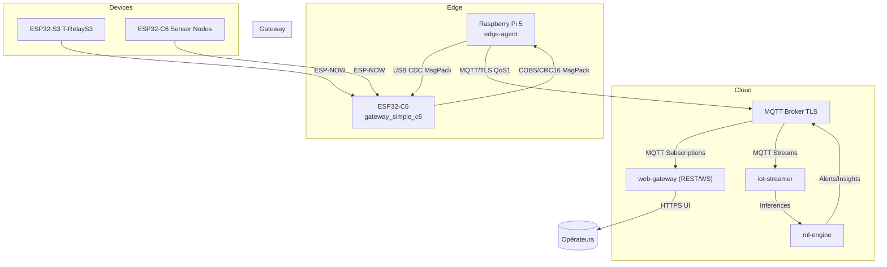
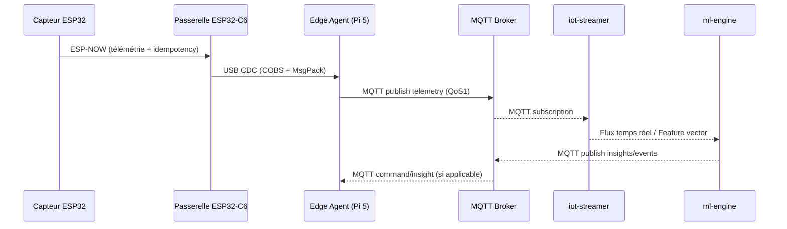
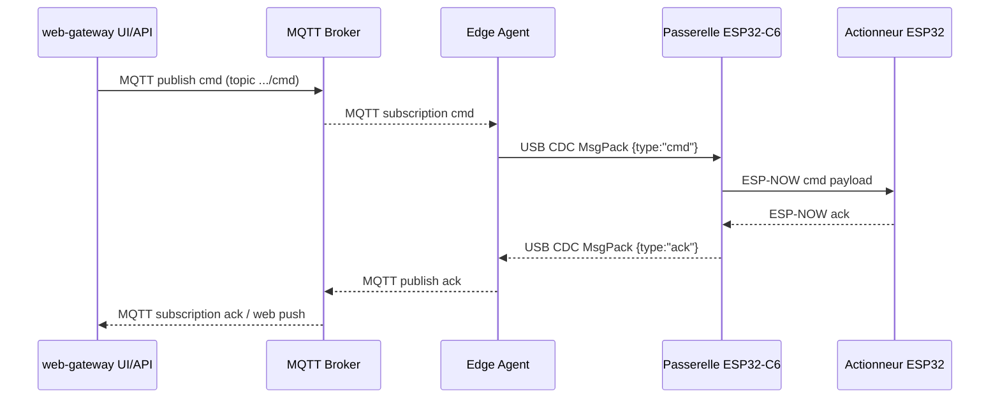
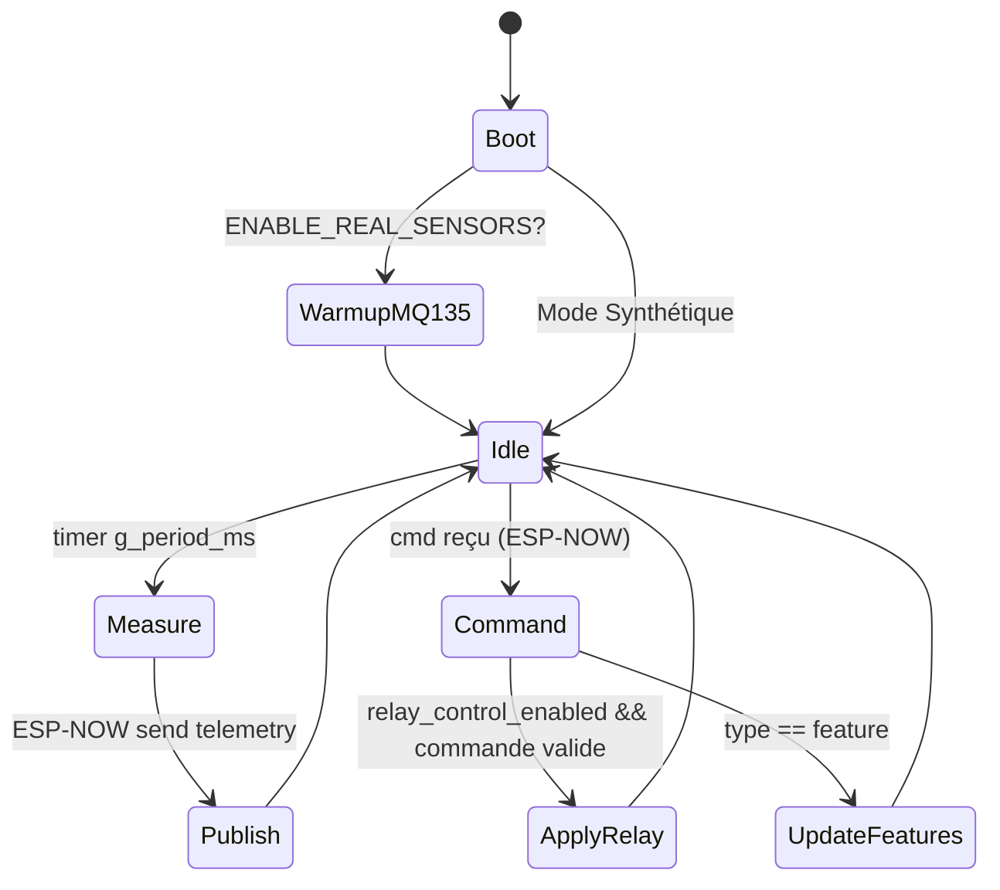
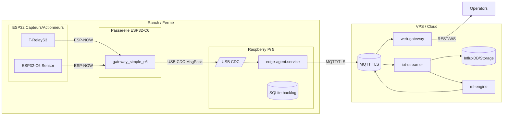
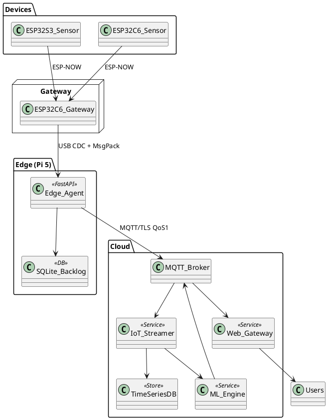

# Prompts & Diagrammes pour Présentations IoTferme

Ce document regroupe des scripts Mermaid/PlantUML et des prompts prêts à l'emploi pour illustrer l'architecture Cloud ↔ Edge ↔ Passerelle ↔ Devices ainsi que les principaux flux du projet IoTferme.

## 1. Vue d'ensemble (Mermaid)

## 2. Flux télémétrie (Mermaid Sequence)

## 3. Flux commande/ACK (Mermaid Sequence)

## 4. Cycle de vie capteur (Mermaid State)

## 5. Déploiement (Mermaid "C4 style")

## 6. Component Diagram (PlantUML)

## 7. Prompts (texte) pour supports projet
- **Pitch architecture** :
  > « Explique en 150 mots comment IoTferme relie capteurs ESP32 via ESP-NOW à une passerelle ESP32-C6, puis au Raspberry Pi 5 qui publie en MQTT/TLS vers notre cluster cloud (web-gateway, iot-streamer, ml-engine). Mets en avant la latence, la résilience offline et la modularité des firmwares. »

- **Risques & mitigations** :
  > « Liste sous forme de tableau les principaux risques techniques (perte USB, panne MQTT, dérive capteurs) et les contre-mesures implémentées dans IoTferme. »

- **Roadmap** :
  > « Propose une roadmap sur 3 releases pour IoTferme, couvrant sécurisation avancée, observabilité et optimisation énergétique. »

Ces prompts peuvent être utilisés avec un LLM pour générer des supports écrits complémentaires.
