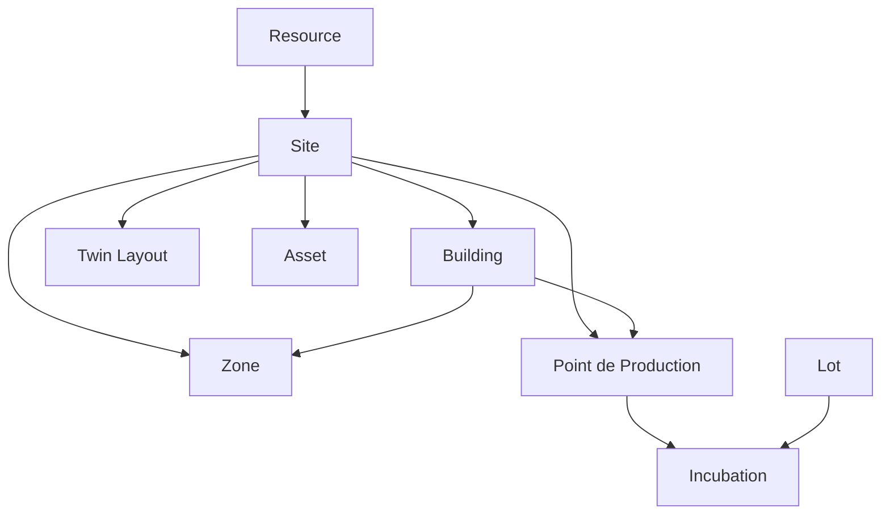

## Schéma global

## Collections et champs clés

### Site (`site.js` – `SiteModel`)
- `site_id` (string, unique)
- `name`, `timezone`, `gps`
- `cameras` (RTSP, Onvif)
- `dyn_fields` via `dynamicFieldsPlugin`

### Building (`building.js` – `BuildingModel`)
- `building_id` (string, unique)
- `site_id`
- `name`, `surface_m2`, `nb_zones`, `usage`
- Relations principales : `site_id`, `zones`, `pp`

### Zone (`zone.js` – `ZoneModel`)
- `zone_id`
- `site_id`, `building_id`
- `surface_m2`, `capacity`

### Point de Production / PP (`pp.js` – `PPModel`)
- `pp_id`
- `site_id`, `building_id`, `zone_id`
- `mode` (poussinière, pondoir, etc.)
- `sensors`, `actuators`
- `thresholds`
- `audit_log`

### Assets (`assets.js` – `AssetModel`)
- `asset_id`
- `site_id`, `type`, `label`, `status`
- `dyn_fields`
- Utilisé pour alimenter le jumeau numérique / simulation

### Twin layout (`twin_model.js` – `TwinModel`)
- `site_id` (unique)
- `layout_version`
- `assets` : array d’objets {`asset_id`, `type`, `position`, `rotation`, `scale`, `metadata`}
- `sceneModelKey`, `metadata`, `editor_state`
- `heatmap_overrides`

### Incubation (`incubation.js` – `IncubationModel`)
- `incubation_id`
- `site_id`, `incubator_id`
- `eggs_loaded`, `start_date`, `expected_hatch_date`
- `status`, `audit_log`

### Lot (`lot.js` – `LotModel`)
- `lot_id`
- `site_id`, `building_id`, `zone_id`
- `target_weight_kg`, `age_days`
- `kpis` (gmq, fcr, etc.)
- `timeline`

### Resource (`resources.js` – `ResourceModel`)
- `resource_id`
- `site_id`, `category`, `name`
- `stock_level`, `unit`, `reorder_point`

## Préparation / Seed
- Fichier : `src/dao/seed/init.seed.js`
- Crée le site `SITE:KIN-GOLIATH`, bâtiments A/B, zones, PPs, assets, resources, twin initial
- Utilise `bulkWrite` pour idempotence

## Rappels techniques
- Tous les modèles héritent de `auditTrailPlugin` (timestamps, audit_log)
- `dynamicFieldsPlugin(scope)` permet d’ajouter des champs dynamiques selon `field_def.js`
- Connexion initialisée via `createConnection` (cf. `src/dao/models/common.js`)
- L’application Express consomme ces modèles dans les services (ex: `twin.service.js`, `lot.service.js`)

## Points d’attention
- Les indices uniques (`site_id`, `building_id`, `asset_id`) imposent d’utiliser `upsert` avec précaution
- Pour de nouvelles entités, suivre le pattern `dyn_fields` + `audit_log`
- Garder la cohérence des identifiants (`canonicalId`) avec le jumeau numérique (Bâtiment 1 = `BLDG:A`)

